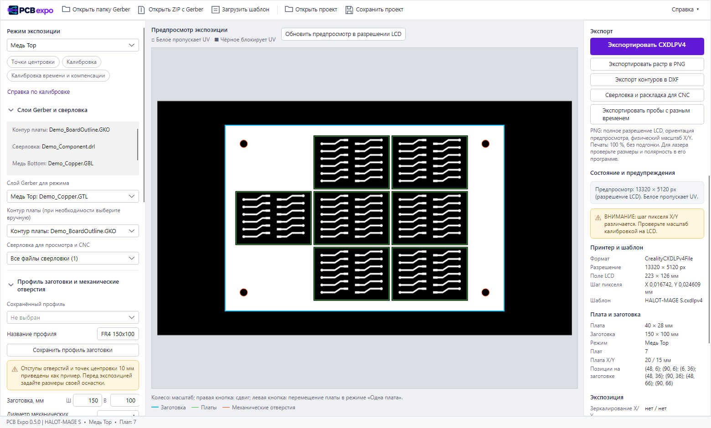

  

# PCB Expo

**Из Gerber — в экспозиционную маску для LCD-принтера и раскладку плат для CNC.**

PCB Expo — настольное приложение для изготовления печатных плат с помощью LCD-засветки. Оно размещает платы на текстолите, готовит изображения меди, паяльной маски и трафарета из фотополимера и сохраняет однослойные задания **CXDLPV4** для **Creality HALOT-MAGE S**. Для механической обработки та же раскладка экспортируется в **DXF**.

**0.5.0 — выпуск с обновлённым интерфейсом и экспортом PNG.** Программные проверки выполнены; физическая работа на принтере и станке пока не подтверждена. Перед изготовлением платы проверьте масштаб, ориентацию и режим засветки на контрольном образце.

[Скачать релиз](https://github.com/Antidods/PCB_expo/releases) · [Руководство](docs/user-guide.md) · [Сборка из исходников](docs/development.md) · [Сообщить об ошибке](https://github.com/Antidods/PCB_expo/issues)

*Скриншот приложения с искусственным демонстрационным рисунком. Время и параметры на нём служат примером интерфейса.*

## Интерфейс

- **Сверху:** открытие папки или ZIP Gerber, загрузка шаблона, открытие и сохранение проекта. Меню **Справка** открывает справку по калибровке и окно «О программе».
- **Слева:** выбор режима экспозиции и быстрый переход к центровке и калибровке. Слои и сверловка, профиль заготовки, размещение плат и параметры экспозиции собраны в сворачиваемые секции.
- **В центре:** предпросмотр маски, обновление в разрешении LCD и легенда контуров. Колесо мыши меняет масштаб, правая кнопка сдвигает изображение, левая перемещает плату в режиме **Одна плата**.
- **Справа:** закреплённые команды экспорта CXDLPV4, PNG, DXF, раскладки для CNC и проб с разным временем. Ниже отдельно прокручиваются состояние, предупреждения и сводка параметров.

## Возможности

| Задача | Что делает приложение |
| --- | --- |
| Импорт | Открывает папку или ZIP с Gerber и Excellon, распознаёт слои и позволяет назначить их вручную. |
| Раскладка | Размещает одну плату или заполняет заготовку прямоугольной сеткой с полями, интервалами и зонами вокруг центровочных отверстий. |
| Медь и паяльная маска | Готовит Top/Bottom с физическим переворотом заготовки, зеркалированием, инверсией, временем и компенсацией края. Заполняет свободное поле между платами, оставляя снаружи каждой платы тёмный контур 0,5 мм и сохраняя центровочные отверстия тёмными. |
| Паяльный трафарет | Засвечивает всю заготовку; окна PasteMaskLayer и центровочные отверстия оставляет тёмными. Поддерживает Top/Bottom. |
| Калибровка | Строит эталон масштаба и матрицу линий/просветов для подбора времени и компенсации; экспортирует независимые пробы и таблицу результатов. |
| CXDLPV4 | Создаёт один слой в разрешении LCD из вашего шаблона, затем повторно открывает файл и сравнивает изображение и параметры. |
| PNG для фотошаблона и лазера | Сохраняет текущую маску в полном разрешении LCD, в ориентации предпросмотра и с физическим масштабом отдельно по X/Y. |
| DXF для CNC | Экспортирует всю раскладку с выбираемым составом: заготовка, центровочные отверстия, контуры и вырезы плат, механическая сверловка, переходные отверстия и отверстия компонентов. |
| Предпросмотр и проекты | Светлая тема, верхняя панель команд, сворачиваемые параметры и закреплённый экспорт. Растр в полном разрешении LCD, увеличение и перемещение внутри области просмотра, сохраняемые проекты и профили. |
| Служебные линии | Общая толщина для точек центровки, окружностей отверстий, рамки текстолита и геометрической калибровки. Калибровочный квадрат утолщается внутрь, сохраняя внешний размер 50 × 50 мм. |

## Быстрый старт

1. На странице [Releases](https://github.com/Antidods/PCB_expo/releases) скачайте `PcbExpo-0.5.0-win-x64.zip` и распакуйте **весь архив** в отдельную папку.
2. Запустите `PcbExpo.App.exe`. Устанавливать .NET отдельно не требуется: Windows x64-пакет содержит среду выполнения.
3. На верхней панели нажмите **Загрузить шаблон** и выберите подходящий `.cxdlpv4` для HALOT-MAGE S. Шаблон принтера не входит в релиз. Локальный файл `150x100.cxdlpv4` можно также положить рядом с exe для автоматической загрузки.
4. Нажмите **Открыть папку Gerber** или **Открыть ZIP с Gerber**. В секции **Слои Gerber и сверловка** слева проверьте контур платы, назначение слоёв и сверловки.
5. В секции **Профиль заготовки и механические отверстия** задайте размеры заготовки и центровочных отверстий. В секции **Положение и размещение плат** разместите плату или выберите **Заполнить заготовку**.
6. Проведите калибровку масштаба, времени и компенсации для своего материала. Режимы **Калибровка** и **Калибровка времени и компенсации** доступны слева; порядок действий приведён в меню **Справка → Справка по калибровке** и [руководстве](docs/user-guide.md#калибровка-времени-и-компенсации).
7. Выберите **Режим экспозиции** слева и проверьте параметры в секции **Преобразования и экспозиция**. Справа нажмите **Экспортировать CXDLPV4**, **Экспортировать растр в PNG** или **Сверловка и раскладка для CNC**. Кнопка **Экспорт контуров в DXF** открывает остальные варианты геометрии.

В экспозиционном предпросмотре **белое пропускает UV, чёрное закрывает его**. Для трафарета белым остаётся материал, а тёмными — будущие окна пасты. Bottom учитывает переворот всей заготовки относительно её вертикальной оси.

Для DXF заготовки, контура платы и CNC шаблон принтера не нужен. DXF содержит геометрию в миллиметрах, масштаб 1:1; траектории инструмента и управляющую программу следует подготовить в CAM.

## Совместимость и ограничения

- Целевая платформа релиза: **Windows x64**. Приложение построено на .NET 10 и Avalonia; пакеты для других ОС в этом выпуске не предоставляются.
- Целевой принтер: **Creality HALOT-MAGE S**, формат **CXDLPV4**. Размер поля и разрешение берутся из шаблона. Совместимость с другими принтерами не заявляется.
- Раскладка содержит копии одной платы, без поворота отдельных экземпляров. В экспозиции заготовка и габариты платы прямоугольные; контуры и вырезы для CNC экспортируются отдельно.
- Категория сверловки назначается **целому Excellon-файлу**. Если в одном файле смешаны via, отверстия компонентов и механические отверстия, разделите их в CAD для независимого выбора.
- Предпросмотр и экспорт используют пиксельную сетку LCD. Увеличение сверх разрешения LCD показывает реальные пиксели; оно не добавляет детализацию в исходный рисунок.
- Время, компенсация, PWM, направление изображения и физический масштаб требуют проверки на вашем оборудовании. Подробные условия и ограничения перечислены в [руководстве](docs/user-guide.md#известные-ограничения).

## Документация и участие

- [Руководство пользователя](docs/user-guide.md): координаты, переворот Bottom, трафарет, калибровка, DXF и форматы хранения.
- [Разработка и сборка релиза](docs/development.md): требования, запуск, тесты, автономный exe и диагностика.
- [Изменения](CHANGELOG.md) и [описание выпуска 0.5](docs/releases/v0.5.0.md).

Ошибки и предложения можно оставить в [Issues](https://github.com/Antidods/PCB_expo/issues). Для воспроизведения укажите версию приложения, режим и последовательность действий; приложите минимальный Gerber-набор, если его можно опубликовать. Pull request с исправлением или улучшением документации приветствуется.

## Лицензия и благодарности

Copyright © 2026 PCB Expo contributors. PCB Expo распространяется по **AGPL-3.0-or-later** — [полный текст лицензии](LICENSE). Программа предоставляется без гарантий, в пределах условий этой лицензии.

Проект использует [UVtools](https://github.com/sn4k3/UVtools) для работы с Gerber и форматами LCD-принтеров, [Avalonia](https://github.com/AvaloniaUI/Avalonia) для интерфейса и [Emgu CV](https://github.com/emgucv/emgucv) для обработки изображений. Версии, лицензии и ссылки на исходники зависимостей приведены в [THIRD_PARTY_NOTICES.md](THIRD_PARTY_NOTICES.md).

PCB Expo — независимый проект, не связанный с Creality или EasyEDA.
